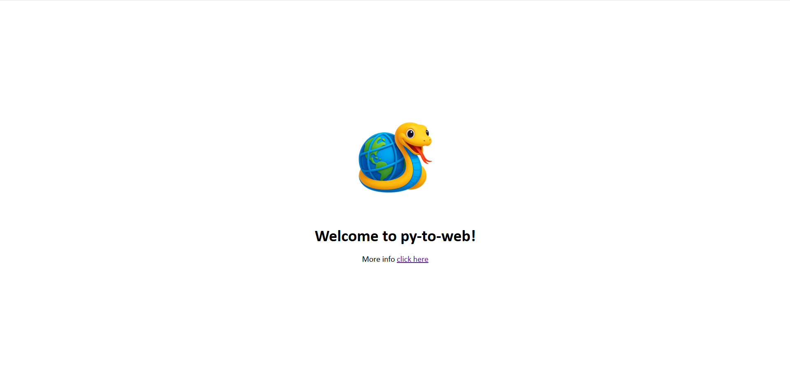

# 🐍 py-to-web

<p align="center">
  
</p>

**py-to-web** is a minimal Python-based framework that lets you build web pages using plain Python functions instead of HTML. Inspired by React and JSX, but for Python.

## ⚡ Features

* Write HTML structures using Python functions
* Modular component support (like `el_header`, `el_footer`, etc.)
* Live rebuild on changes using [`py-mon`](https://github.com/SpotlightKid/py-mon)
* Built-in HTTP server to serve output folder
* Supports passing custom props to components

## 📦 Installation

```bash
git clone https://github.com/DreamerView/py-to-web.git
cd py-to-web
pip install -r requirements.txt
```

Install `py-mon` globally (for development):

```bash
pip install py-mon
```

## 🚀 Getting Started

```bash
pymon dev.py
```

## 🌐 Preview

Open `http://localhost:8000` in your browser after running `dev.py`.



This command watches changes in `pages/`, `components/`, and `public/`, and rebuilds HTML files in the `output/` folder.

## 🧱 Folder Structure

```
py-to-web/
├── components/
│   ├── header.py
│   ├── footer.py
│   └── ...
├── pages/
│   ├── index.py
│   └── about.py
├── py_to_web/
│   └── core.py
└── dev.py
```

## 🛠 Example

```python
# pages/index.py
from components.footer import el_footer
from py_to_web.core import el

def render():
    return el("html", children=[
        el("head", children=[
            el("title", text="Hello py-to-web"),
            el("link", rel="stylesheet", href="https://cdn.jsdelivr.net/npm/bootstrap@5.3.7/dist/css/bootstrap.min.css")
        ]),
        el("body", children=[
            el("div", cls="container", children=[
                el("h1", text="Welcome to py-to-web!"),
                el_footer(title="Made with ❤️ by Temirhan")
            ])
        ])
    ])
```

## 🔄 Component with Props

```python
# components/footer.py
from py_to_web.core import el

def el_footer(**props):
    return el("footer", cls="site-footer", children=[
        el("p", text=props.get("title", "© 2025 Default Title"))
    ])
```

## 📜 License

MIT © 2025 Temirhan